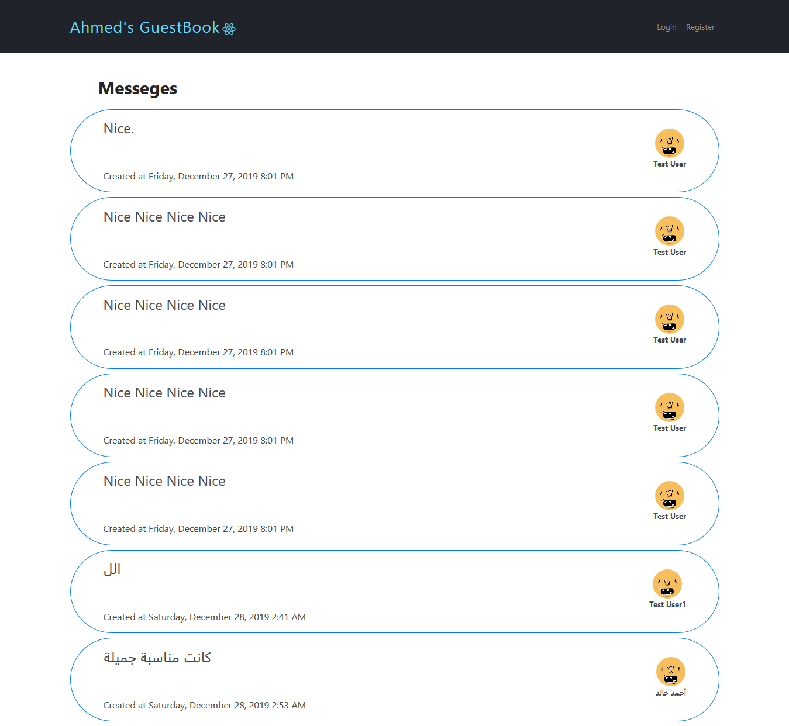
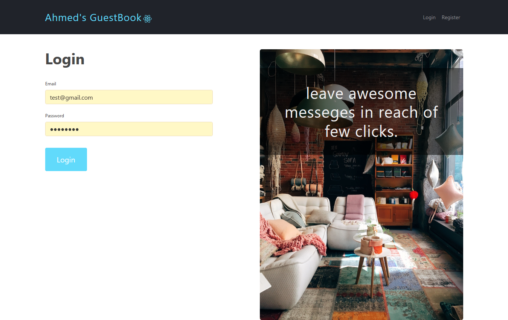
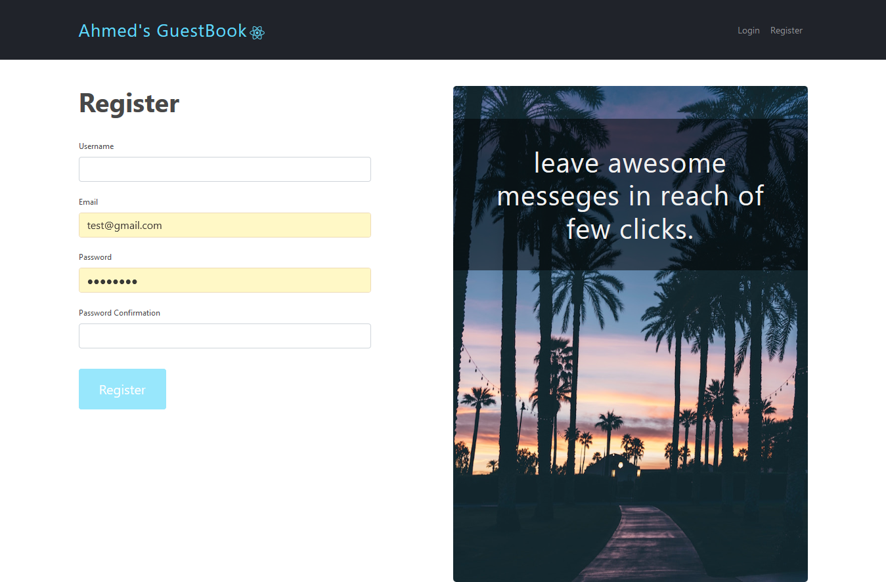
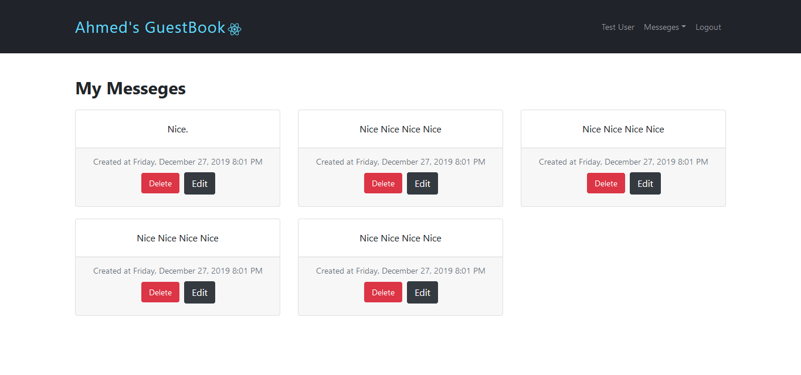

# GuestBook

    => live On Heroku https://stormy-chamber-81080.herokuapp.com/messeges

    using MERN Stack ( React / NodeJS / Express / MongoDB)

To Run This Project : 

    - First Install dependencies package.json ( npm install )  in ( Package.json in src Root) && ( Package.json in client Root)
    - Second run ( npm run dev ) in ( src root ) => that run ( Backend Server on PORT 5000 && FrontEnd Server on PORT 3000 ) concurrently
    - Third open Browser and type ( localhost:3000/ )

About the GuestBook :

    The users able to:
        - Create an account
        - Log in
        - Write/Edit/Delete Messages
        - And reply to messages

Home Page :

    

Login Page :

    

Register Page : 

    

Manage Your Messeges Page :

    

- project Divided into two Steps (Client / Server) :

    - client/

        - contain ( components folder login / register / messeges ) Designs Folders
        - styles Folder
        - actions Folder => that connect Functions FrontEnd To BackEnd APIs
        - services Folder => that auth user when fetch APIs By check authentication
    
    - server files in src/ root
        - two roots ( users and messeges )
        - two models ( users and messeges )
        - controllers folder ( contain routes)
        - helpers folder ( contain mongoosse normalizeErrors)
        - data.json contain test data
        - fake-db.js to load data.json data to mongoDB